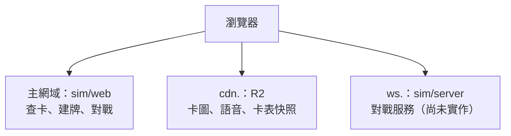

# 部署邊界

本頁整理已確認的部署分工；對戰服務尚未實作。元件存在與否依
[專案架構](../../AGENTS.md) 與 [引擎現況](../sim/engine-status.md)，
下圖的對戰服務代表設計邊界，不代表已上線。

## 前端、CDN 與對戰服務

依 [AGENTS 的前端與部署邊界](../../AGENTS.md#前端與部署邊界)，查卡、建牌、對戰共用
`sim/web`，在同一主網域以路徑區分，例如 `/cards`、`/decks`、`/play`。
卡圖、語音與卡表快照放 Cloudflare R2，由 `cdn.` 子網域提供；
規劃中的 `sim/server` 對戰服務使用 `ws.` 子網域。

前端採 Workers 靜態資源，前端與對戰服務分開部署；這是
[既有開發環境設計](cloudflare-development.md#1-同網域資料入口與環境表) 的分工。
正式 CDN 使用 R2 自訂網域直出；開發環境以受保護的同源 `/cdn-preview/` 路徑讀取私有桶，
詳細入口保護與平台驗證條件仍以該文件為準。前端部署流程不應連帶重新部署對戰服務。

## 卡片資料權威

依 [AGENTS](../../AGENTS.md)，`carddb` 匯出的有版號卡表快照是卡片資料的唯一權威。
前端與引擎可以載入、打包或快取快照，但不另建獨立卡表。
建置 SQLite 不交給玩家；公開欄位與傳輸契約分別見
[快照格式](../schema/snapshot-format.md) 與 [快照傳輸](../schema/snapshot-transport.md)。

公開快照與卡圖的保留窗口依 [ADR-0016](../adr/0016-snapshot-retention.md)，
不由對戰部署設計擴大為永久歷史服務。回放與歷史資料的關係見 [回放契約](replays.md)。

## 建局與用量控制

維護者在 2026-09-25 的部署討論中明示確認兩項要求，整理來源由
[#473](https://github.com/gbaian10/sve-kit/issues/473) 指定：

- 必須有停止開新局的熔斷開關，以限制濫用造成的成本。
- 帳號的總局數不限，但每小時開局數要有上限；超過時要求稍後再試，不因此封鎖帳號。

這些是設計要求，尚無伺服器實作保證。本頁不指定額度數字、檢查週期、觸發門檻或登入供應商，
也不提供服務容量或費用承諾。
