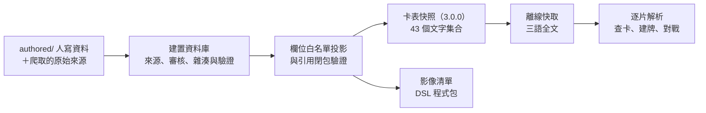

# 卡片資料 schema

範例中的官方卡名、商品名、日英原始詞彙與卡文片段為來源引用，不在本專案授權內；
資料結構、合成範例與驗證規則屬專案設計。見[文件引用說明](../quotations.md)。

版本：**v1**，2026-09-28 定案。用語依 [`GLOSSARY.md`](../../GLOSSARY.md)。

這些文件描述資料契約；公開 JSON Schema、獨立 reader 與共用合成樣本的入口見[機器契約](export/snapshot-contract.md)。建置與發布閘門的規格驗收和傳輸形狀驗證分開。

## 分層導覽

文件依 `carddb/src/sve_carddb/` 的主要責任歸屬收在下列目錄；跨域契約只保留一份權威文件。
既有文件整份搬移，章節編號與契約的權威關係維持不變。

| 目錄 | 主要責任 |
| --- | --- |
| `ingest/` | 來源抓取、不可變歸檔與恢復 |
| `build/` | 建置資料庫與逐表實作分期 |
| `domains/` | 人工輸入、身分、詞彙、構築與翻譯採納 |
| `images/` | 卡圖衍生檔與裁切覆寫 |
| `export/` | 公開投影、快照傳輸、匯出與用戶端交接 |

### 來源（ingest）

| 文件 | 內容 |
| --- | --- |
| [來源歸檔與凍結輸入](ingest/source-archive.md) | raw 歷史、版本 inventory、鎖與一致副本、保留及備份恢復 |
| [受保護抓取的操作條件](ingest/refresh-operation.md) | refresh 前置保護、來源封存與中斷恢復 |

### 建置（build）

| 文件 | 內容 |
| --- | --- |
| [建置資料庫 schema](build/build-db.md) | 建置資料庫 126 表的完整邏輯契約：欄位、鍵、約束、採納政策、雜湊與發布閘門 |
| [程式分層](build/code-layers.md) | carddb 內部層次與匯入邊界 |
| [建置表實作分期](build/implementation-tiers.md) | 126 表各自的實作 tier（T0～T3）與首發必要集合 |

### 資料領域（domains）

| 文件 | 內容 |
| --- | --- |
| [authored 維護方式](domains/authored-layout.md) | `authored/` 已定案身分登錄與其餘配置提案 |
| [卡名概念與身分關聯](domains/card-name-concepts.md) | exact 名稱自動推導與人工例外、預設選面及修復後重驗 |
| [正式 catalog 輸入](domains/catalog-inputs.md) | 職業／基本卡種永久 code、YAML caller 資料、JP／EN binding 與 preview 重建 |
| [詞彙與路由契約](domains/catalog-route-adoption.md) | current 詞彙與展示覆寫；已核可稀有度白名單及繁中缺譯順序 |
| [構築規則與禁限採納](domains/construction-adoption.md) | Standard 專用封套、來源登錄、有限 ref／CR 引用與 coverage／unknown 邊界 |
| [數位對應採納契約](domains/digital-link-adoption.md) | 真人 link 入口、凍結名稱與逐 owner 使用；政策連結見獨立契約 |
| [數位名字與同名瀏覽政策](domains/digital-name-policy.md) | 可修改的名字／同名瀏覽規則、排除與待啟用能力 |
| [風味文字直接對照表](domains/flavor-translation.md) | 以原文 hash 對照整段譯文；不走模板、不設採納政策 |
| [術語採納與加粗](domains/glossary-adoption.md) | 永久概念、當前選詞、來源主張、可修訂加粗與公開標註 |
| [身分修復與決定續版](domains/identity-repair.md) | 已核可的不可變續版、指名撤回、完整面／插畫移轉與有效投影 |
| [人工限量序號版次](domains/manual-printings.md) | 獨立入口、官方封存／第三方 URL、SNC／WB 歸屬、序號補充及人工名稱邊界 |
| [模板參數辨識規則](domains/template-parameter-policy.md) | 具名辨識開關、參數驗證與退回原因 |
| [四層來源位置](domains/four-layer-source-positions.md) | 四層來源核心、binding／未匹配清單與來源定位 |
| [翻譯與模板契約](domains/translation-contract.md) | JP 唯一一般來源、當前資料、逐 owner 顯示與跨區規則資格 |
| [四層翻譯共用契約](domains/four-layer-translation.md) | Frame／SourceBinding、typed 葉、形式與 NP、建置目標欄位、位置與重鍵 |
| [四層固定案例](domains/four-layer-cases.md) | 機器可讀的合成輸入／預期結果及真實來源邊界索引；不是已通過測試紀錄 |
| [翻譯維護流程](domains/translation-policy.md) | 一般資料 PR、低信心顯示與必要自動檢查 |

### 影像（images）

| 文件 | 內容 |
| --- | --- |
| [插畫裁切覆寫](images/image-crop-overrides.md) | 來源鍵與 raw hash、單檔與預設框、建置端框比對與重印診斷 |
| [卡圖衍生檔契約](images/image-variants.md) | 直向／橫向五檔 WebP、裁切取整與原圖邊界 |

### 匯出（export）

| 文件 | 內容 |
| --- | --- |
| [preview 建置與前端接線](export/preview-handoff.md) | 本機配方、匯出根、圖片快取與前端載入 |
| [公開投影](export/public-projection.md) | 發布版次、區域閉包與公開文字集合的篩選 |
| [公開 annotation 與 JP 依據](export/public-annotation.md) | 3.0.0 的稀疏位置集合、公開來源指標、逐 owner 語言與引用閉包 |
| [公開 annotation 固定案例](export/public-annotation-cases.md) | 元件 Schema、共用合成正反例與 producer／reader／Web 接線責任 |
| [容量與記憶體預算](export/size-budget.md) | 卡表快照的容量門檻、量測方法與目前結論 |
| [機器契約](export/snapshot-contract.md) | Schema 資源、候選格式配置、Python reader 與 TS 驗收清單 |
| [快照匯出流程](export/snapshot-export.md) | 凍結輸入、建置配方、公開投影、媒體與傳輸產出 |
| [卡表快照格式](export/snapshot-format.md) | 3.0.0 的 43 個文字集合與 3 個影像集合的欄位白名單、快照清單、分片與更新規則 |
| [快照傳輸契約](export/snapshot-transport.md) | manifest、config、tuple descriptor、fragment 身分與欄序、版本及變動摘要 |

## 文件之間的關係



- **build-db.md 是建置資料庫的權威**；snapshot-format.md 只描述投影出來的公開欄位。表名相同不代表欄位相同，快照沒有列出的欄位一律不出貨。
- 卡表快照依 `AGENTS.md` 是卡片資料的唯一權威；前端可以快取它，但不另外維護卡表。
- implementation-tiers.md 的逐表分配必須與 build-db.md 的 126 表完全一致；authored-layout.md 說明 `authored/` 如何匯入建置資料庫。
- 效果 DSL 的語法以 `dsl/` 的 JSON Schema 與 [`docs/dsl/`](../dsl/README.md) 為準，這裡只記錄 DSL 文件、審核與載入結果的資料表。

## ER 圖

互動 ER 圖由 `build/build-db.md` 與 `export/snapshot-format.md` 直接產生，從 repo 根目錄執行：

```bash
uv run tools/schema-er/build_er.py            # 產生後用瀏覽器開啟
uv run tools/schema-er/build_er.py --no-open  # 只產生（CI、hook 用）
uv run tools/schema-er/build_er.py --serve    # 產生後在 localhost:8000 提供（SSH 時搭配 port 轉送）
```

輸出在 `tools/schema-er/out/`（不進 git）：`schema-er.html` 是單檔頁面，`parse-report.txt` 是解析報告，`schema-model.json` 是從 Markdown 讀出的中間資料（除錯用）。`--out <路徑>/schema-er.html` 改輸出位置，`--artifact` 省略 doctype 外殼。有任何欄位無法解析、PK 無法標記、FK 目標不存在或分組錯誤時，不產生 HTML 並以非零狀態結束；修改 `docs/schema/` 時 pre-commit 會跑一次確認能產出。分組與快照欄名的引用對應寫在 `tools/schema-er/diagram.toml`，新增表或集合時要一起登記。

建置資料庫的 126 表分成 12 組（來源與確認、身分與商品、插畫與加工、文字與勘誤、跨區與構築、問答與裁定、數位與語音、翻譯依賴、DSL 證據、機制、影像與更正、顯示與路由）；3.0.0 卡表快照的 46 個集合（43 文字＋3 影像）分成 6 組。
圖中的箭頭表示「引用者 → 被引用者」，不是時序，也不表示基數；線條分三種：欄位宣告的 FK、約束 `FK(...)` 宣告的 FK（複合約束保留兩側完整欄組，以粗線標示）、依 `*_id` 欄名推斷的引用（卡表快照沒有 FK 記號，全部屬於這種，並包含內嵌陣列與物件裡的 ID）。正式的複合 FK、nullable 與部分唯一性以 build-db.md 為準；固定 `vocabulary` kind 的常數欄由 DDL 展開，不出現在邏輯表中。

## 資料未知與未啟用能力

以下是資料缺漏時的長期行為；實作進度與資料交付放 issue／milestone，不能以規格存在推定已驗收。

- 未啟用的資料能力仍須按[建置表分組](build/implementation-tiers.md)處理完整依賴，公開 required 欄位不可任意省略。
- 缺正式 DSL 或引擎證據維持手動／unknown，reviewed 不等於 engine_passed。
- 來源日期不在 complete 覆蓋範圍時，合法性維持 unknown；印刷原文、加工、發行與語音缺證據不推定不存在。
- Decklog 查證須有地區與精確版次依據，不能假設外部 ID 等於卡號；未查證沿 printing 的明示預設並標記未核對。
- 同號 variant 與跨區同卡號不能任選；若無法沿現有路由唯一定位，停止該路徑發布，保留既有 canonical。
- 更正只套用仍符合原值及來源證據者；衝突停用該項，未確認候選不套用。
- 無資料與畫面需要的延後模型不建空表，玩家帳號／同步資料不進卡表快照。
- 容量與手機效能須按[量測契約](export/size-budget.md)驗收，舊配置估算不當現行配置通過。
