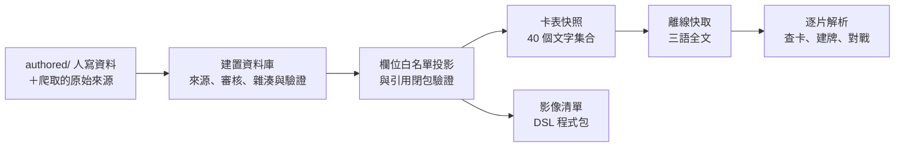

# 卡片資料 schema

版本：**v1**，2026-09-28 定案。用語依 [`docs/terminology.md`](../terminology.md)。

這些文件描述資料契約；公開 JSON Schema、獨立 reader 與共用合成樣本的入口見[機器契約](snapshot-contract.md)。建置與發布閘門的規格驗收和傳輸形狀驗證分開。

## 文件

| 文件                                          | 內容                                                                              |
| --------------------------------------------- | --------------------------------------------------------------------------------- |
| [建置資料庫 schema](build-db.md)              | 建置資料庫 121 表的完整邏輯契約：欄位、鍵、約束、採納政策、雜湊與發布閘門         |
| [卡表快照格式](snapshot-format.md)            | 發布給使用者的 40 個文字集合與 3 個影像集合的欄位白名單、快照清單、分片與更新規則 |
| [快照傳輸契約](snapshot-transport.md)         | manifest、config、tuple descriptor、fragment 身分與欄序、版本及變動摘要           |
| [機器契約](snapshot-contract.md)              | Schema 資源、候選格式配置、Python reader 與 TS 驗收清單                           |
| [卡圖衍生檔契約](image-variants.md)           | 直向／橫向五檔 WebP、裁切取整與原圖邊界                                           |
| [來源歸檔與凍結輸入](source-archive.md)       | raw 歷史、版本 inventory、鎖與一致副本、保留及備份恢復                            |
| [容量與記憶體預算](size-budget.md)            | 卡表快照的容量門檻、量測方法與目前結論                                            |
| [建置表實作分期](implementation-tiers.md)     | 121 表各自的實作 tier（T0～T3）與首發必要集合                                     |
| [身分修復與決定續版](identity-repair.md)      | 已核可的不可變續版、指名撤回、完整面／插畫移轉與有效投影                          |
| [authored 維護方式](authored-layout.md)       | `authored/` 已定案身分登錄、其餘配置提案與批次決定封套                            |
| [詞彙與路由契約](catalog-route-adoption.md)   | 採納封套與覆寫；已核可稀有度白名單及繁中缺譯順序                                  |
| [正式 catalog 輸入](catalog-inputs.md)        | 職業／基本卡種永久 code、YAML caller 資料、JP／EN binding 與 preview 重建         |
| [術語採納與加粗](glossary-adoption.md)        | 概念引用、來源主張／委託收據、可修訂加粗與公開格式擴充影響                        |
| [數位對應採納契約](digital-link-adoption.md)  | 待審的 link／coverage 入口、人工續版、凍結名稱與逐 owner 使用條件；尚未實作       |
| [翻譯與模板採納契約](translation-contract.md) | 已核可的來源／抽查／提前顯示；人工採納、推導重建與跨區契約                        |
| [卡名概念與身分關聯](card-name-concepts.md)   | exact 名稱自動推導與人工例外、預設選面及修復後重驗                                |
| [模板採納政策與收據](translation-policy.md)   | authored 政策索引、不可變核可收據、首輪抽查與長尾驗證閉包                         |
| [風味文字整段翻譯](flavor-translation.md)     | 零參數模板、完整段落 span、獨立 recipe／新 ID 與譯本採納政策                      |

## 文件之間的關係



- **build-db.md 是建置資料庫的權威**；snapshot-format.md 只描述投影出來的公開欄位。表名相同不代表欄位相同，快照沒有列出的欄位一律不出貨。
- 卡表快照依 `AGENTS.md` 是卡片資料的唯一權威；前端可以快取它，但不另外維護卡表。
- implementation-tiers.md 的逐表分配必須與 build-db.md 的 121 表完全一致；authored-layout.md 說明 `authored/` 如何匯入建置資料庫。
- 效果 DSL 的語法以 `dsl/` 的 JSON Schema 與 [`docs/dsl/`](../dsl/README.md) 為準，這裡只記錄 DSL 文件、審核與載入結果的資料表。

## ER 圖

互動 ER 圖由 build-db.md 與 snapshot-format.md 直接產生，從 repo 根目錄執行：

```bash
uv run docs/schema/er/build_er.py            # 產生後用瀏覽器開啟
uv run docs/schema/er/build_er.py --no-open  # 只產生（CI、hook 用）
uv run docs/schema/er/build_er.py --serve    # 產生後在 localhost:8000 提供（SSH 時搭配 port 轉送）
```

輸出在 `docs/schema/er/out/`（不進 git）：`schema-er.html` 是單檔頁面，`parse-report.txt` 是解析報告，`schema-model.json` 是從 Markdown 讀出的中間資料（除錯用）。`--out <路徑>/schema-er.html` 改輸出位置，`--artifact` 省略 doctype 外殼。有任何欄位無法解析、PK 無法標記、FK 目標不存在或分組錯誤時，不產生 HTML 並以非零狀態結束；修改 `docs/schema/` 時 pre-commit 會跑一次確認能產出。分組與快照欄名的引用對應寫在 `docs/schema/er/diagram.toml`，新增表或集合時要一起登記。

建置資料庫的 121 表分成 12 組（來源與確認、身分與商品、插畫與加工、文字與勘誤、跨區與構築、問答與裁定、數位與語音、翻譯依賴、DSL 證據、機制、影像與更正、顯示與路由）；卡表快照的 43 個集合分成 6 組。
圖中的箭頭表示「引用者 → 被引用者」，不是時序，也不表示基數；線條分三種：欄位宣告的 FK、約束 `FK(...)` 宣告的 FK（複合約束保留兩側完整欄組，以粗線標示）、依 `*_id` 欄名推斷的引用（卡表快照沒有 FK 記號，全部屬於這種，並包含內嵌陣列與物件裡的 ID）。正式的複合 FK、nullable 與部分唯一性以 build-db.md 為準；固定 `vocabulary` kind 的常數欄由 DDL 展開，不出現在邏輯表中。

## 待辦與待實作驗收

已定案的設計不再列於此。以下是實作、資料或量測尚未完成的項目；完成前一律依「完成前的行為」處理，不能假裝已完成。

| 項目                          | 待做                                                                                                                                           | 完成前的行為                                                                                                |
| ----------------------------- | ---------------------------------------------------------------------------------------------------------------------------------------------- | ----------------------------------------------------------------------------------------------------------- |
| 正式 DDL、匯出器              | 依本規格實作建置資料庫 DDL（含常數 kind 欄展開）、投影匯出器與發布閘門                                                                         | 沒有可發布的卡表快照；不能聲稱 FK、PWA 或容量已全數通過                                                     |
| 永久登錄匯入與身分修復        | authored 永久 ID／配號工具已實作；待正式建置匯入器與 identity_change 執行流程                                                                  | 已配號只增不改；本機 registry 不能當作可發布快照                                                            |
| 模板 ID 碰撞檢查              | 保留既有 10 hex 模板 ID、完整內容不可覆寫；normalizer 或參數改版時新 ID＋`supersedes`                                                          | 舊依賴不移動、標 stale 重驗；不能只升 hash 就保留 verified                                                  |
| 雜湊遷移 ADR                  | 把 `rule-bundle-v2` 與既有 `face-bundle-v1` 證據的遷移規則寫成 ADR                                                                             | 依 build-db.md §14：以舊 recipe 計算的證據保留，但要重驗一次才能 verified                                   |
| 引擎驗證政策                  | 第一版驗證政策須包含載入、基本局面與必要題本，並對應原錯誤碼                                                                                   | 卡表可先上線，缺證據一律手動處理；不能把 reviewed 當 `engine_passed`                                        |
| Decklog 來源與外部 ID         | 研究 JP/EN Decklog 卡片清單來源或 API、完整範圍與精確版次 ID 對照；兩區各至少一份含普通、特殊、再錄與同號 variant 的匯入樣本                   | 不假設外部 ID 等於卡號；未查證依官方卡表收錄預設（收錄 true、未收錄 false）並標示；Decklog 匯入需求不標完成 |
| 手機實測                      | 中階 Android 與 iPad 量測解析、搜尋、切換語言、更新與離線峰值（見 [size-budget.md](size-budget.md)）；多尺寸卡圖、2.5D 與動態 atlas 的尺寸實測 | 數字只是估算與預算；不全包常駐解析，卡表不加 sprite                                                         |
| 啟動包容量                    | 正式匯出器產出雙區、三語名稱翻譯後的啟動包，量測是否 ≤ 1 MiB（壓縮後）                                                                         | 目前只有日文部分的原型量測                                                                                  |
| 勘誤歷史資料                  | 勘誤歷史的來源覆蓋、生效日與印刷適用證據                                                                                                       | current 可讀；印刷原文 unknown 時說明原因；歷史時間未知不猜                                                 |
| 來源覆蓋區間                  | `source_windows` 與 `restriction_coverage` 的實際資料                                                                                          | 日期不在 complete 範圍內時，合法性為 unknown                                                                |
| 同號 variant                  | 同地區同卡號的多個 variant 依證據拆分（預設 `standard`），入口例外固定                                                                         | 不覆蓋真實差異，不以同號任選圖                                                                              |
| 數位對應                      | `same_card` 個案重新分類（close/partial/redesigned）、svwb style 永久 key 對齊                                                                 | 批次 sampled 才可採納，未採納留未知；不漏背面                                                               |
| 機制詞彙                      | relation 四種與資源產生／消耗 action 的詞彙審核                                                                                                | partial 不能推 absent；EN 差異另設 scope                                                                    |
| 構築規則資料                  | `rules_name` 作為禁限單位；雙面、合作名、`treated_as` 依 `construction_rules_ref` 計數                                                         | 未支援的規則回 unknown，不逐面重複計張                                                                      |
| 語音資料                      | 語音分類與互動目標、browse 與 battle 的適用審核                                                                                                | 沒有語音資料不表示該卡沒有語音；來源 URL 必須保留                                                           |
| 框的詞彙                      | 從資料整理穩定的 `frame_code`，原字保留                                                                                                        | `signed`／`premium` 未知為 null；預設版次不聲稱已確認普通框                                                 |
| 發行證據                      | 各區版次的發行證據；`announced`／`not_released_confirmed` 只存例外                                                                             | 未對照不等於尚未發售                                                                                        |
| 卡店連結與畫師連結            | 真實卡店 HTTPS 模板（feature flag）；`artist_link`／`art_post` 待有畫面與資料時設計                                                            | 不捏造連結，示例模板停用                                                                                    |
| 已確認更正的正式匯入          | 已有 9 筆 active 更正；待建置資料庫與快照匯入器接入既有投影（見 [§3.4](authored-layout.md#34-來源更正)）                                       | 已確認者無須重審；每次套用仍驗原值、觀測 hash 與圖片證據，衝突停用；未確認候選不套用                        |
| 延後的資料模型                | `event`／`printing_event`、`signature`／`printing_signature`、`query_alias` 複合條件、Decklog 外部 ID 格式                                     | 不建空表；標誌列表不能稱某場活動的全部獎卡                                                                  |
| 登入與同步                    | 玩家帳號、牌組、設定的 D1 同步是否在首版提供（屬 server）                                                                                      | 卡表快照不含玩家內容                                                                                        |
| 搜尋文法                      | 定義 `config.search.grammar_version` 所指的搜尋語法（欄位篩選、運算子、正規化）文件與版本規則                                                  | 只提供一般關鍵字與篩選介面，不宣稱支援進階語法                                                              |
| 跨區同卡號路徑                | 目前官英卡號帶 EN 後綴不會撞號；若日後出現 JP/EN 原卡號完全相同的情況再決定路徑                                                                | 遇到時停止發布該路徑，不破壞既有 canonical                                                                  |
